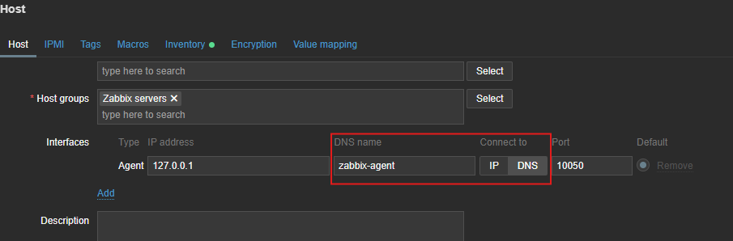

# Lazy Zabbix

This repository offers a ready-to-use Docker Compose setup for Zabbix: Server, Proxy, Web Frontend, and Agent, backed by MariaDB.

## Table of Contents

- [Features](#features)
- [Prerequisites](#prerequisites)
- [Setup](#setup)
- [TLS / PSK Configuration](#tls--psk-configuration)
- [Ports](#ports)
- [License](#license)
- [Contribution](#contribution)

## Features

- MariaDB configured with UTF-8 (utf8mb4) for Zabbix
- Zabbix Server, Web, Agent, Proxy, SNMP Traps ready
- Volumes for persistent data
- Optional TLS/PSK for Zabbix Proxy

## Prerequisites

Before proceeding, make sure you have Docker or Podman installed, as well as the appropriate Compose tool.

## Setup

Start by cloning the repository and navigating into the project directory:

```bash
git clone <https://github.com/netns/zbx-docker.git>
cd zbx-docker
```

Next, create a `.env` file in the project root if it does not already exist. This file is used to define environment variables required by the containers. For example:

```py
MYSQL_PASSWORD=supersecretpassword
PHP_TZ=America/New_York
```

Once the environment variables are set, start the server using Docker Compose. Make sure to replace `<Compose File>` with the appropriate compose file name:

```bash
docker compose -f <Compose File> up -d
```

After the containers are running, adjust the Zabbix server self-monitoring configuration. In a containerized environment, 127.0.0.1 does not work as expected, so the Zabbix server must be configured to use the zabbix-agent service and its DNS hostname defined in Docker Compose.

The image below shows an example of the correct self-monitoring configuration:



## Proxy TLS / PSK Configuration

> [!WARNING]
> Before proceeding, make sure to set the correct permissions for your files to ensure security and proper functionality.

If you are configuring PSK-based TLS, you need to start by mounting your key file at `./proxy-tls/proxy_psk.key`. After mounting the key, check that the environment variable `ZBX_TLSCONNECT` is set to `psk`. Additionally, make sure that `ZBX_TLSPSKIDENTITY` matches the PSK identity configured on the server. This ensures that the proxy can authenticate correctly with the server using the pre-shared key.

For Certificate-based TLS, you will need three files: `ca.pem`, `proxy.crt`, and `proxy.key`. Place all of them inside the `./proxy-tls` directory. Next, set `ZBX_TLSCONNECT` to `cert` to indicate that TLS will use certificates for authentication. You must also configure the environment variables `ZBX_TLSCAFILE`, `ZBX_TLSCERTFILE`, and `ZBX_TLSKEYFILE` to point to the corresponding certificate files. This configuration allows the proxy to securely verify the server and establish a trusted TLS connection using certificates.

Following these steps carefully ensures that your proxy communicates securely with the server, whether you are using PSK-based or certificate-based TLS.

## Ports

| Service          | Container Port | Host Port |
| ---------------- | -------------- | --------- |
| Zabbix Server    | 10051          | 10051     |
| Zabbix Web       | 8080           | 8080      |
| Zabbix Web HTTPS | 8443           | 8443      |
| SNMP Traps       | 1162/udp       | 1162/udp  |

> [!WARNING]
> Do not bind 162/udp directly; non-root alternative port 1162 is used.

## License

This project is licensed under the MIT License. See the [LICENSE](LICENSE) file for details.

## Contribution

Contributions are welcome! Feel free to open issues or submit pull requests to improve font selection, installation scripts, or documentation.
